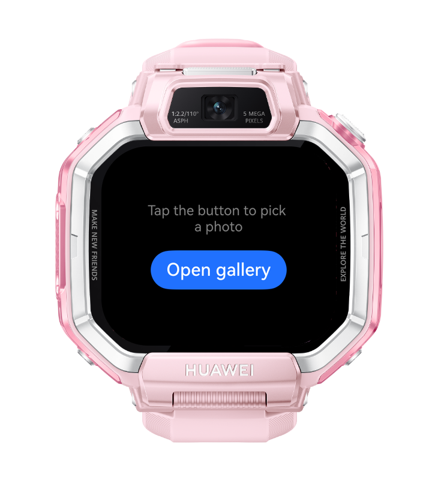
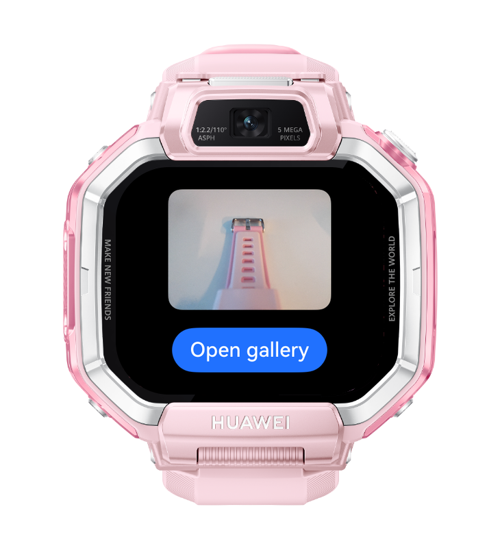

> **Note:** To access all shared projects, get information about environment setup, and view other guides, please visit [Explore-In-HMOS-Wearable Index](https://github.com/Explore-In-HMOS-Wearable/hmos-index).

# How to Access System Gallery on Kids Watch
This sample demonstrates how to integrate **Media Library Kit** on a Kids Watch using the HarmonyOS `photoAccessHelper` system picker. 
Note: As a system picker, photoAccessHelper **requires no permission** 

# Preview
<div>
  
  
</div>

# Use Cases
- Retrieve selected image and/or videos into the application
- Open the system gallery directly with no additional permissions

# Tech Stack
- **Language:** ArkTS
- **Framework**: HarmonyOS SDK 6.1.1(24)
- **Tools** DevEco Studio 6.1.1 Release
- **Libraries**:
  - **Media Library Kit:** `photoAccessHelper`
  - **Basic Services Kit:** `BusinessError` used for typed error handling

# Directory Structure
```
entry/src/main/
├── ets/
│   └── pages/
│       └── Index.ets  # Main Page with the photoAccessHelper gallery picker demo
└── module.json5
```

# Constraints and Restrictions
## Supported Devices
- Huawei Watch Kids X1

# LICENSE
**How to Access System Gallery on Kids Watch** is distributed under the terms of the **MIT License**.
See the [LICENSE](/LICENSE) for more information.
